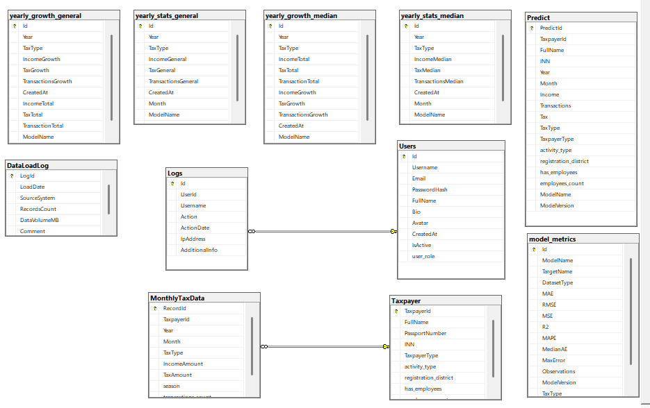

# The Database for project - Taxpayer_Database_DiplomaProject (model/generate data/script.sql)

# Database Documentation

## Overview

This document provides comprehensive documentation for the Taxpayer_Database_DiplomaProject database. It includes
information about the database schema, tables, relationships, and important considerations for developers and database
administrators.

## Database Information

- **Database Name**: Taxpayer_Database_DiplomaProject
- **Database Type**: MS SQL

## Schema Diagram

## Tables

### 1. **Taxpayer**

Stores basic information about taxpayers (individuals or entities).

| Column Name           | Data Type     | Constraints                | Description                                       |
|-----------------------|---------------|----------------------------|---------------------------------------------------|
| TaxpayerId            | int           | IDENTITY(1,1), PRIMARY KEY | Unique identifier for each taxpayer               |
| FullName              | nvarchar(200) | NOT NULL                   | Full name of the taxpayer                         |
| PassportNumber        | nvarchar(20)  | NOT NULL, UNIQUE           | Passport number (unique)                          |
| INN                   | char(12)      | NOT NULL, UNIQUE           | Taxpayer Identification Number (unique)           |
| TaxpayerType          | char(10)      | NOT NULL                   | Type of taxpayer (e.g., individual, legal entity) |
| activity_type         | nvarchar(100) | NOT NULL                   | Type of economic activity                         |
| registration_district | nvarchar(100) | NOT NULL                   | District of registration                          |
| has_employees         | bit           | NOT NULL                   | Whether the taxpayer has employees                |
| employees_count       | int           | NULL                       | Number of employees (if has_employees = 1)        |

**Check Constraint**: `CK_Taxpayer_Employees` ensures consistency between `has_employees` and `employees_count`:

- If `has_employees = 0`, `employees_count` must be NULL
- If `has_employees = 1`, `employees_count` must be ≥ 1

### 2. **MonthlyTaxData**

Contains monthly tax declaration data for taxpayers.

| Column Name        | Data Type     | Constraints                | Description                             |
|--------------------|---------------|----------------------------|-----------------------------------------|
| RecordId           | int           | IDENTITY(1,1), PRIMARY KEY | Unique record identifier                |
| TaxpayerId         | int           | NOT NULL, FOREIGN KEY      | References Taxpayer(TaxpayerId)         |
| Year               | smallint      | NOT NULL                   | Tax year                                |
| Month              | tinyint       | NOT NULL                   | Tax month (1-12)                        |
| TaxType            | char(10)      | NOT NULL                   | Type of tax                             |
| IncomeAmount       | decimal(15,2) | NULL                       | Income amount for the period            |
| TaxAmount          | decimal(15,2) | NOT NULL                   | Tax amount calculated                   |
| season             | nvarchar(10)  | NOT NULL                   | Season (Winter, Spring, Summer, Autumn) |
| transactions_count | int           | NOT NULL                   | Number of transactions                  |

**Check Constraints**:

- `Month` must be between 1 and 12
- `season` must be one of: 'Зима' (Winter), 'Весна' (Spring), 'Лето' (Summer), 'Осень' (Autumn)
- `transactions_count` must be ≥ 0

**Foreign Key**: `FK_MonthlyTax_Taxpayer` links to Taxpayer table

### 3. **Predict**

Stores tax payment predictions generated by ML models.

| Column Name           | Data Type     | Constraints                | Description                    |
|-----------------------|---------------|----------------------------|--------------------------------|
| PredictId             | int           | IDENTITY(1,1), PRIMARY KEY | Unique prediction identifier   |
| TaxpayerId            | int           | NOT NULL                   | Taxpayer ID                    |
| FullName              | nvarchar(255) | NOT NULL                   | Taxpayer's full name           |
| INN                   | nvarchar(12)  | NOT NULL                   | Taxpayer Identification Number |
| Year                  | int           | NOT NULL                   | Prediction year                |
| Month                 | int           | NOT NULL                   | Prediction month               |
| Income                | decimal(18,2) | NOT NULL                   | Predicted income               |
| Transactions          | int           | NOT NULL                   | Predicted transaction count    |
| Tax                   | decimal(18,2) | NOT NULL                   | Predicted tax amount           |
| TaxType               | nvarchar(50)  | NULL                       | Type of tax                    |
| TaxpayerType          | nvarchar(50)  | NULL                       | Type of taxpayer               |
| activity_type         | nvarchar(50)  | NULL                       | Economic activity type         |
| registration_district | nvarchar(100) | NULL                       | Registration district          |
| has_employees         | bit           | NULL                       | Whether has employees          |
| employees_count       | int           | NULL                       | Number of employees            |
| ModelName             | nvarchar(100) | NULL                       | Name of ML model used          |
| ModelVersion          | nvarchar(50)  | NULL                       | Version of ML model            |

### 4. **model_metrics**

Stores performance metrics for machine learning models.

| Column Name  | Data Type     | Constraints                     | Description                             |
|--------------|---------------|---------------------------------|-----------------------------------------|
| Id           | int           | IDENTITY(1,1), PRIMARY KEY      | Unique metric identifier                |
| ModelName    | nvarchar(100) | NOT NULL                        | Name of the model                       |
| TargetName   | nvarchar(100) | NOT NULL                        | Target variable predicted               |
| DatasetType  | nvarchar(50)  | NOT NULL                        | Type of dataset (train/test/validation) |
| MAE          | float         | NOT NULL                        | Mean Absolute Error                     |
| RMSE         | float         | NOT NULL                        | Root Mean Square Error                  |
| MSE          | float         | NOT NULL                        | Mean Square Error                       |
| R2           | float         | NOT NULL                        | R-squared score                         |
| MAPE         | float         | NULL                            | Mean Absolute Percentage Error          |
| MedianAE     | float         | NULL                            | Median Absolute Error                   |
| MaxError     | float         | NULL                            | Maximum Error                           |
| Observations | int           | NULL                            | Number of observations                  |
| ModelVersion | nvarchar(50)  | NULL                            | Model version                           |
| TaxType      | nvarchar(20)  | NULL                            | Tax type the model predicts             |
| CreatedAt    | datetime2(7)  | NOT NULL, DEFAULT sysdatetime() | Record creation timestamp               |

### 5. **Users**

Stores system user information for authentication and authorization.

| Column Name  | Data Type      | Constraints                     | Description                      |
|--------------|----------------|---------------------------------|----------------------------------|
| Id           | int            | IDENTITY(1,1), PRIMARY KEY      | Unique user identifier           |
| Username     | nvarchar(50)   | NOT NULL, UNIQUE                | Username for login               |
| Email        | nvarchar(255)  | NOT NULL, UNIQUE                | User email address               |
| PasswordHash | nvarchar(255)  | NOT NULL                        | Hashed password                  |
| FullName     | nvarchar(150)  | NOT NULL                        | User's full name                 |
| Bio          | nvarchar(max)  | NULL                            | User biography                   |
| Avatar       | varbinary(max) | NULL                            | User avatar image                |
| CreatedAt    | datetime2(7)   | NOT NULL, DEFAULT sysdatetime() | Account creation timestamp       |
| IsActive     | bit            | NULL, DEFAULT 1                 | Whether user account is active   |
| user_role    | nvarchar(15)   | NULL                            | User role (admin/analyst/viewer) |

### 6. **Logs**

Tracks user activities in the system.

| Column Name    | Data Type     | Constraints                | Description                     |
|----------------|---------------|----------------------------|---------------------------------|
| Id             | bigint        | IDENTITY(1,1), PRIMARY KEY | Unique log identifier           |
| UserId         | int           | NULL, FOREIGN KEY          | References Users(Id)            |
| Username       | nvarchar(100) | NOT NULL                   | Username of the actor           |
| Action         | nvarchar(500) | NOT NULL                   | Description of action performed |
| ActionDate     | datetime2(7)  | NOT NULL                   | Timestamp of action             |
| AdditionalInfo | nvarchar(max) | NULL                       | Additional context information  |

**Foreign Key**: `FK_Logs_Users` with CASCADE DELETE

### 7. **yearly_stats_general**

Stores general yearly statistics aggregated from tax data.

| Column Name         | Data Type     | Constraints                 | Description                |
|---------------------|---------------|-----------------------------|----------------------------|
| Id                  | int           | IDENTITY(1,1), PRIMARY KEY  | Unique record identifier   |
| Year                | int           | NOT NULL                    | Statistical year           |
| Month               | int           | NOT NULL                    | Statistical month          |
| TaxType             | char(10)      | NULL                        | Type of tax                |
| IncomeGeneral       | decimal(18,2) | NOT NULL                    | General income total       |
| TaxGeneral          | decimal(18,2) | NOT NULL                    | General tax total          |
| TransactionsGeneral | decimal(18,2) | NOT NULL                    | General transaction total  |
| CreatedAt           | datetime2(7)  | NULL, DEFAULT sysdatetime() | Record creation timestamp  |
| ModelName           | nvarchar(100) | NULL                        | Model used for calculation |
| ModelVersion        | nvarchar(50)  | NULL                        | Model version              |

### 8. **yearly_stats_median**

Stores median yearly statistics aggregated from tax data.

| Column Name        | Data Type     | Constraints                 | Description                |
|--------------------|---------------|-----------------------------|----------------------------|
| Id                 | int           | IDENTITY(1,1), PRIMARY KEY  | Unique record identifier   |
| Year               | int           | NOT NULL                    | Statistical year           |
| Month              | int           | NOT NULL, DEFAULT 1         | Statistical month          |
| TaxType            | char(10)      | NULL                        | Type of tax                |
| IncomeMedian       | decimal(18,2) | NOT NULL                    | Median income              |
| TaxMedian          | decimal(18,2) | NOT NULL                    | Median tax                 |
| TransactionsMedian | decimal(18,2) | NOT NULL                    | Median transactions        |
| CreatedAt          | datetime2(7)  | NULL, DEFAULT sysdatetime() | Record creation timestamp  |
| ModelName          | nvarchar(100) | NULL                        | Model used for calculation |
| ModelVersion       | nvarchar(50)  | NULL                        | Model version              |

### 9. **yearly_growth_general**

Stores general yearly growth metrics.

| Column Name        | Data Type     | Constraints                 | Description                    |
|--------------------|---------------|-----------------------------|--------------------------------|
| Id                 | int           | IDENTITY(1,1), PRIMARY KEY  | Unique record identifier       |
| Year               | int           | NOT NULL                    | Growth year                    |
| TaxType            | char(10)      | NULL                        | Type of tax                    |
| IncomeGrowth       | decimal(10,2) | NOT NULL                    | Income growth percentage       |
| TaxGrowth          | decimal(10,2) | NOT NULL                    | Tax growth percentage          |
| TransactionsGrowth | decimal(10,2) | NOT NULL                    | Transactions growth percentage |
| CreatedAt          | datetime2(7)  | NULL, DEFAULT sysdatetime() | Record creation timestamp      |
| IncomeTotal        | decimal(18,2) | NOT NULL, DEFAULT 0         | Total income                   |
| TaxTotal           | decimal(18,2) | NOT NULL, DEFAULT 0         | Total tax                      |
| TransactionTotal   | decimal(18,2) | NOT NULL, DEFAULT 0         | Total transactions             |
| ModelName          | nvarchar(100) | NULL                        | Model used for calculation     |
| ModelVersion       | nvarchar(50)  | NULL                        | Model version                  |

### 10. **yearly_growth_median**

Stores median yearly growth metrics.

| Column Name        | Data Type     | Constraints                 | Description                           |
|--------------------|---------------|-----------------------------|---------------------------------------|
| Id                 | int           | IDENTITY(1,1), PRIMARY KEY  | Unique record identifier              |
| Year               | int           | NOT NULL                    | Growth year                           |
| TaxType            | char(10)      | NULL                        | Type of tax                           |
| IncomeTotal        | decimal(18,2) | NOT NULL                    | Total income                          |
| TaxTotal           | decimal(18,2) | NOT NULL                    | Total tax                             |
| TransactionTotal   | decimal(18,2) | NOT NULL                    | Total transactions                    |
| IncomeGrowth       | decimal(10,2) | NOT NULL                    | Median income growth percentage       |
| TaxGrowth          | decimal(10,2) | NOT NULL                    | Median tax growth percentage          |
| TransactionsGrowth | decimal(10,2) | NOT NULL                    | Median transactions growth percentage |
| CreatedAt          | datetime2(7)  | NULL, DEFAULT sysdatetime() | Record creation timestamp             |
| ModelName          | nvarchar(100) | NULL                        | Model used for calculation            |
| ModelVersion       | nvarchar(50)  | NULL                        | Model version                         |

## How to fill in the data in the database

model/generate data - directory contains files for generating data

### model/generate data/generate data taxpayer.py

**Purpose**: Master script for generating and populating the `Taxpayer` table with synthetic taxpayer records.

**Functionality**:

- Creates taxpayer profiles with realistic Russian names, passport numbers, and INNs
- Assigns taxpayer types (IP - Individual Entrepreneur, SZ - Self-Employed, etc.)
- Generates activity types based on taxpayer category
- Assigns registration districts
- Determines employee status and counts
- Ensures data uniqueness for critical fields (INN, PassportNumber)

### model/generate data/SZ.py

**Purpose**: Generates monthly tax data for self-employed individuals using a 6% tax rate on actual income.

### model/generate data/IP15.py

**Purpose**:  Generates monthly tax data for individual entrepreneurs using a 15% tax rate on actual income.
For IP6 data generate similar method

### model/generate data/IPOS.py

**Purpose**: Generates monthly tax data for individual entrepreneurs using a **20% tax rate on actual income**.

### model/generate data/IPP.py

**Purpose**: Generates monthly tax data for individual entrepreneurs using a **patent system (6% tax on potential
income)**, where a base potential income is set for each activity type.
