# Tax Forecast Service — Backend

Flask-based backend for a web system that analyzes and forecasts tax revenue dynamics of self-employed individuals (NPD) and sole proprietors (IP) in Russia. Built as the server side of a bachelor's thesis (VKR) project.

> **Scope note:** the system follows the taxation rules of the **Russian Federation** (self-employment tax, USN 6%/15%, OSNO, patent regimes for sole proprietors). All monetary values are in **Russian rubles (RUB)**, and all synthetic data is generated — no real taxpayer data is used (see [Why synthetic data](#why-synthetic-data)).

This repository is the backend only. It's paired with a separate [Nuxt frontend](https://github.com/NinaBlinova/tax-dashboard-client) that renders the dashboard, charts, and reports.

## Table of contents

- [Tech stack](#tech-stack)
- [Architecture](#architecture)
- [Database](#database)
- [Getting started](#getting-started)
- [Project structure](#project-structure)
- [Forecasting models](#forecasting-models)
- [Related repositories](#related-repositories)

## Tech stack

| Layer | Technology |
|---|---|
| API server | [Flask](https://flask.palletsprojects.com/) + Flask-CORS |
| Database | MS SQL Server (via SQLAlchemy + `pyodbc`, ODBC Driver 17) |
| ML / forecasting | scikit-learn, LightGBM, XGBoost, joblib |
| Data processing | pandas, NumPy |
| Report generation | python-docx, matplotlib |
| Synthetic data generation | Faker (`ru_RU` locale) |

MS SQL Server was chosen for its stable integration with Python through `pyodbc` and support for parameterized queries (protection against SQL injection). Flask was chosen for its minimal, unopinionated structure, which made it easy to split the backend into independent modules (auth, analytics, reports) and plug in data-science libraries directly.

## Architecture

The architecture is documented using the **C4 model** (Context → Container → Component), built with [Structurizr](https://structurizr.com/).

### 1. System context

The system has two types of external actors: regular users (analysts, officials) who work with data to make decisions, and administrators who manage accounts and review audit logs.

<p align="center">
  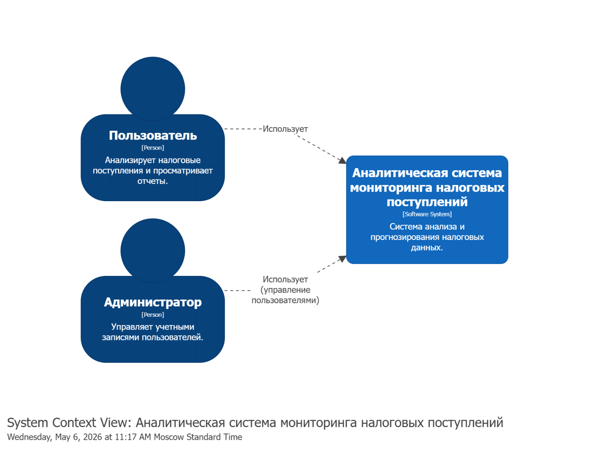
  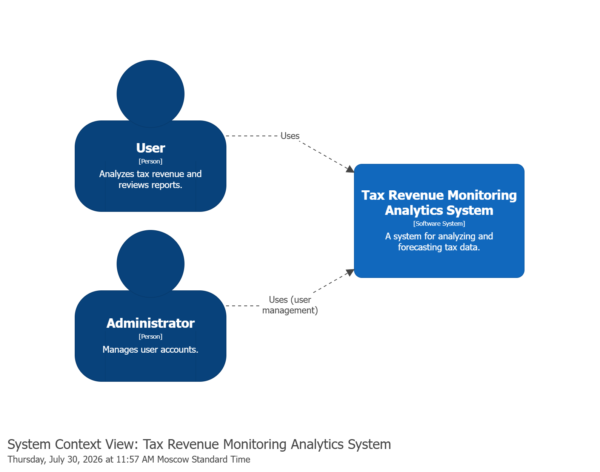
</p>
<p align="center">
  <em>Figure 1. System context diagram (Russian and English).</em>
</p>

### 2. Containers

The system is split into four containers: the client (interface), the server (this repository), the analytics module, and the database.

<p align="center">
  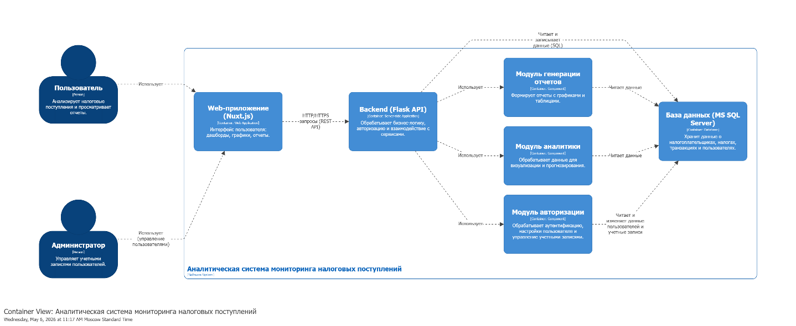
  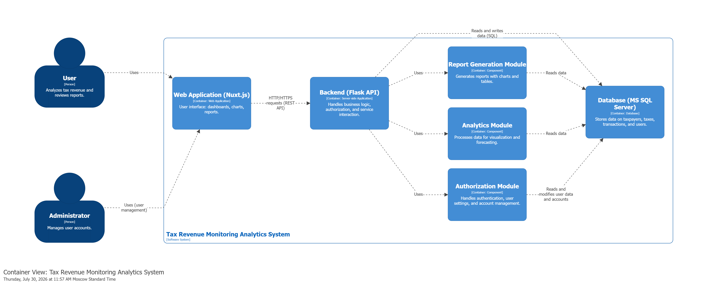
</p>
<p align="center">
  <em>Figure 2. Container diagram (Russian and English).</em>
</p>

- **Client** — [Nuxt.js](https://github.com/NinaBlinova/tax-dashboard-client) web app, renders the dashboard and reports.
- **Server (Flask)** — handles REST requests, business logic, authorization, report generation, and forecasting. Split into three modules:
  - **authModule** — login/logout, user settings, admin account management, audit logs.
  - **reportModule** — exports dashboard data as `.docx` reports.
  - **analyticsModule** — data aggregation, statistics, and ML-based forecasting.
- **Database (MS SQL Server)** — stores taxpayers, transactions, users, and model metrics; supports scheduled backups via SQL Server Agent.

### 3. Components — analytics module

The core module of the system, responsible for aggregating tax data, computing statistics, and generating forecasts.

<p align="center">
  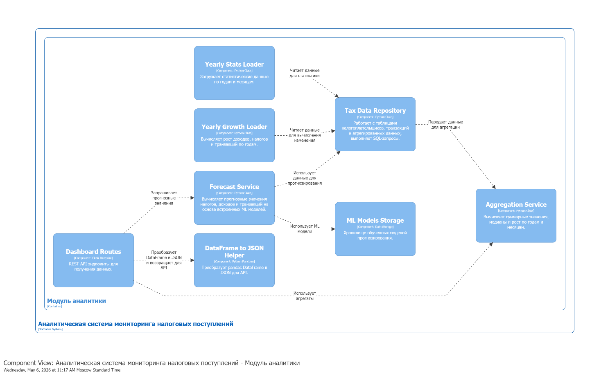
  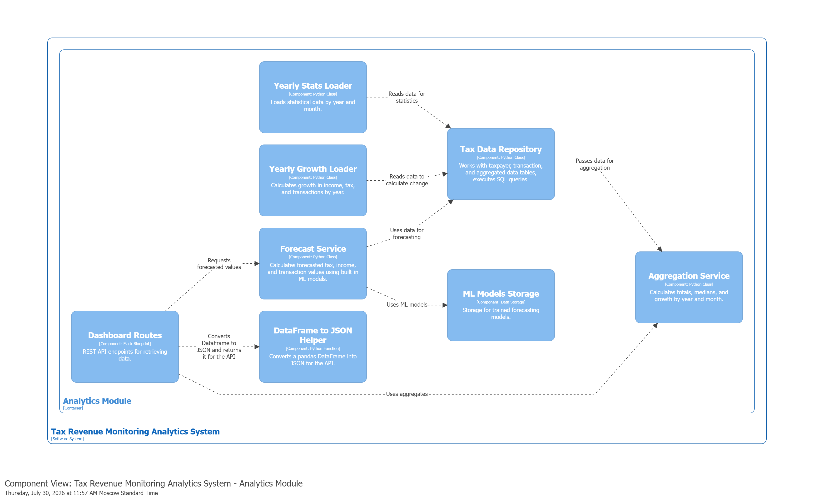
</p>
<p align="center">
  <em>Figure 3. Analytics module component diagram (Russian and English).</em>
</p>

| Component | Responsibility | Source |
|---|---|---|
| Tax Data Repository | Runs SQL queries against the taxpayer database; the single entry point the rest of the module uses to read raw data | `model/data/taxs/TaxDataRepository.py` |
| Aggregation Service | Aggregates income/tax/transactions by year, month, and taxpayer category (sums, averages, medians) | `model/data/taxs/AggregationService.py` |
| Yearly Stats Loader | Loads month-by-month yearly statistics for charts | `model/data/taxs/YearlyLoader_by_month.py` |
| Yearly Growth Loader | Computes year-over-year growth of income, tax, and transactions | `model/data/taxs/YearlyGrowthLoader.py` |
| Forecast Service | Produces forecasts using the active ML model and historical data | `model/manegement_models/ForecastService.py` |
| ML Models Storage | Central storage/registry for trained forecasting models | `model/manegement_models/ModelsRepository.py` |
| DataFrame → JSON Helper | Converts pandas DataFrames into JSON for the REST API | used across `routes/routes_dashboard.py` |
| Dashboard Routes | REST endpoints that expose aggregated and forecasted data to the client | `routes/routes_dashboard.py` |

### 4. Components — authorization module

Handles authentication, access control, and account management.

<p align="center">
  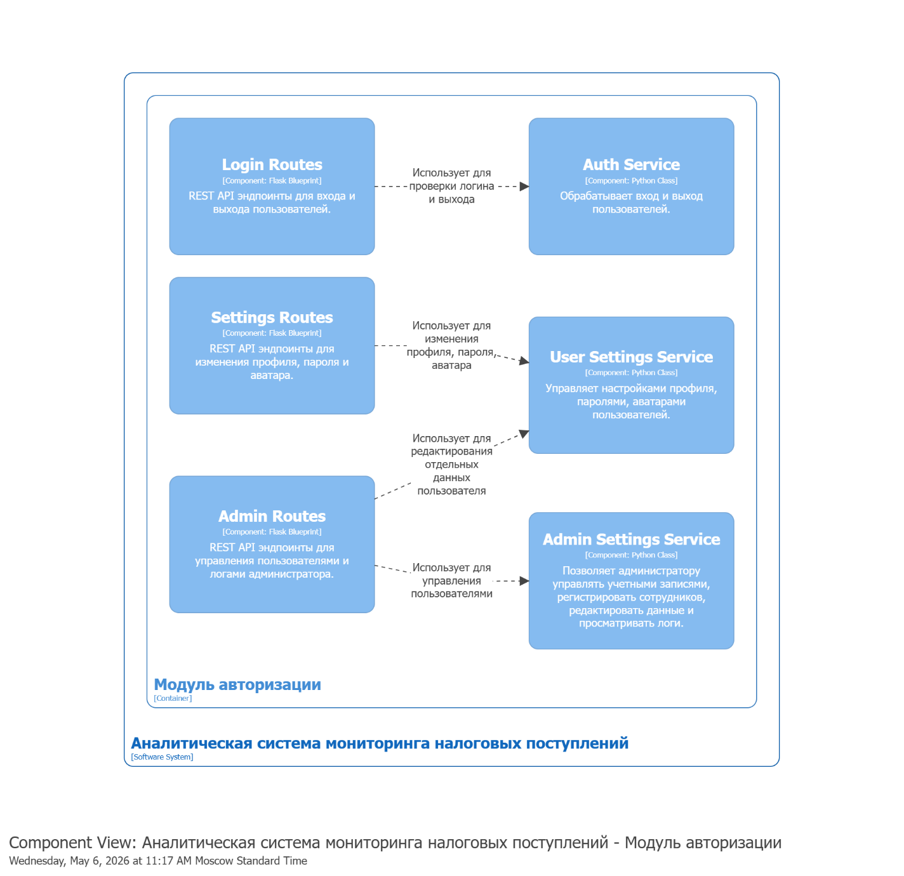
  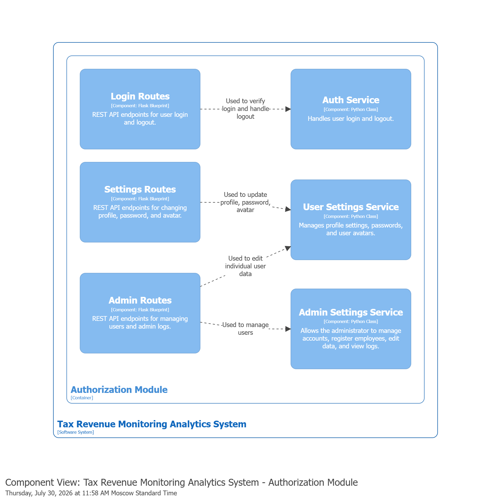
</p>
<p align="center">
  <em>Figure 4. Authorization module component diagram (Russian and English).</em>
</p>

| Component | Responsibility | Source |
|---|---|---|
| Auth Service | Login/logout, session validation | `model/data/login/AuthService.py` |
| User Settings Service | Profile editing: name, password, avatar | `model/data/setting/UserSettingsService.py` |
| Admin Settings Service | User registration, account editing, activation/deactivation, audit log viewing | `model/data/setting/AdminSettingsService.py` |
| Login Routes | REST endpoints for sign-in / sign-out | `routes/routes_login.py` |
| Settings Routes | REST endpoints for profile/password/avatar updates | `routes/routes_setting.py` |
| Admin Routes | REST endpoints for account and log management | `routes/routes_admin.py` |

## Database

**Database name:** `Taxpayer_Database_DiplomaProject` · **Engine:** MS SQL Server

### Why synthetic data

Real taxpayer information is protected under Russian tax secrecy law (Article 102 of the Tax Code) and personal-data protection law (Federal Law No. 152-FZ). To develop and demonstrate the system without any confidentiality risk, all data is **synthetically generated**, calibrated against public aggregate statistics from the Federal Tax Service (FTS), the "Tax on Professional Income" service, and the SME registry — so distributions, seasonality, and income-to-tax ratios stay realistic without using a single real record.

### Schema

The schema is split into three logical groups:

**1. Users & audit log** — `Users` holds staff accounts (credentials, role, active status, personal data); `Logs` records user actions (login/logout, profile edits, report generation) with a cascading FK to `Users`.

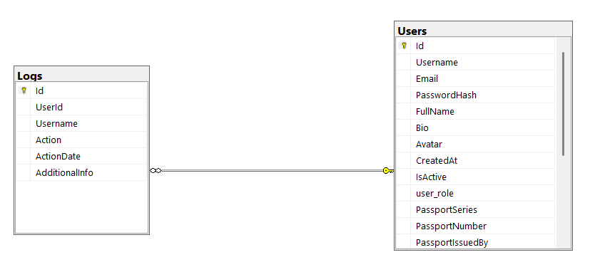

**2. Taxpayers & financial data** — `Taxpayer` holds core taxpayer info (INN, activity type, district, employee count); `MonthlyTaxData` holds monthly income/tax/transaction figures per taxpayer; `Predict` stores ML-generated forecasts.

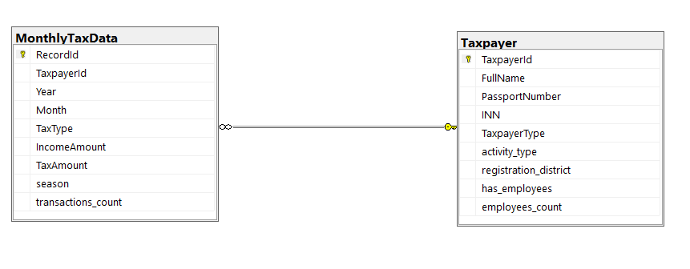

**3. Statistics & model metrics** — `yearly_stats_general`/`yearly_stats_median` aggregate income, tax, and transactions by year for charts; `yearly_growth_general`/`yearly_growth_median` compute year-over-year growth; `model_metrics` stores model quality metrics (MAE, RMSE, R², MAPE, etc.).

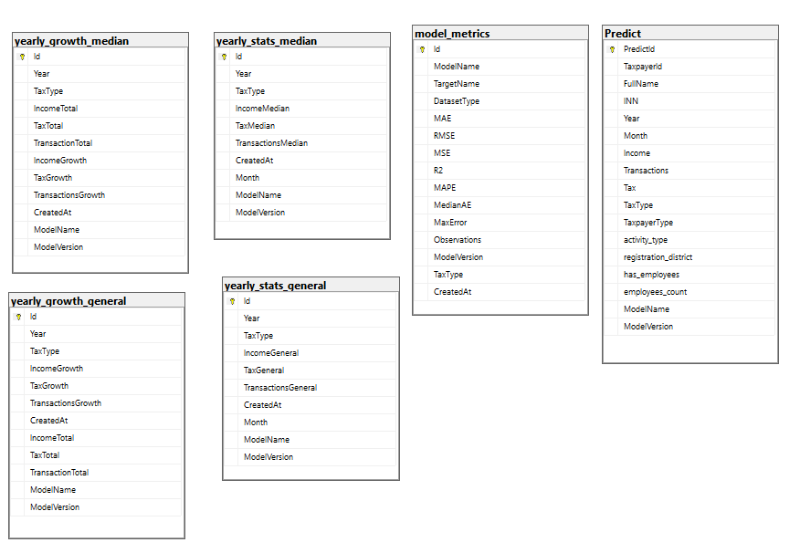

<details>
<summary>Full table reference</summary>

#### Taxpayer

| Column | Type | Constraints | Description |
|---|---|---|---|
| TaxpayerId | int | IDENTITY(1,1), PK | Unique taxpayer identifier |
| FullName | nvarchar(200) | NOT NULL | Full name |
| PassportNumber | nvarchar(20) | NOT NULL, UNIQUE | Passport number |
| INN | char(12) | NOT NULL, UNIQUE | Taxpayer identification number |
| TaxpayerType | char(10) | NOT NULL | `SZ`, `IP6`, `IP15`, `IPOS`, `IPP` |
| activity_type | nvarchar(100) | NOT NULL | Economic activity type |
| registration_district | nvarchar(100) | NOT NULL | District of registration |
| has_employees | bit | NOT NULL | Whether the taxpayer has employees |
| employees_count | int | NULL | Number of employees (required if `has_employees = 1`, must be NULL otherwise — enforced by `CK_Taxpayer_Employees`) |

#### MonthlyTaxData

| Column | Type | Constraints | Description |
|---|---|---|---|
| RecordId | int | IDENTITY(1,1), PK | Unique record id |
| TaxpayerId | int | NOT NULL, FK → Taxpayer | Owning taxpayer |
| Year | smallint | NOT NULL | Tax year |
| Month | tinyint | NOT NULL, CHECK 1–12 | Tax month |
| TaxType | char(10) | NOT NULL | Tax regime code |
| IncomeAmount | decimal(15,2) | NULL | Income for the period |
| TaxAmount | decimal(15,2) | NOT NULL | Calculated tax |
| season | nvarchar(10) | NOT NULL, CHECK | `Зима`/`Весна`/`Лето`/`Осень` |
| transactions_count | int | NOT NULL, CHECK ≥ 0 | Number of transactions |

#### Predict

| Column | Type | Constraints | Description |
|---|---|---|---|
| PredictId | int | IDENTITY(1,1), PK | Unique prediction id |
| TaxpayerId, FullName, INN | — | NOT NULL | Taxpayer reference/snapshot |
| Year, Month | int | NOT NULL | Forecast period |
| Income, Transactions, Tax | decimal/int | NOT NULL | Forecasted values |
| TaxType, TaxpayerType, activity_type, registration_district | nvarchar | NULL | Taxpayer context at prediction time |
| has_employees, employees_count | bit / int | NULL | Taxpayer context at prediction time |
| ModelName, ModelVersion | nvarchar | NULL | Model used for the prediction |

#### model_metrics

| Column | Type | Constraints | Description |
|---|---|---|---|
| Id | int | IDENTITY(1,1), PK | Unique metric id |
| ModelName, TargetName, DatasetType | nvarchar | NOT NULL | Model, predicted target, dataset split |
| MAE, RMSE, MSE, R2 | float | NOT NULL | Core error metrics |
| MAPE, MedianAE, MaxError, Observations | float/int | NULL | Extra diagnostics |
| ModelVersion, TaxType | nvarchar | NULL | Model version / tax regime |
| CreatedAt | datetime2(7) | NOT NULL, DEFAULT sysdatetime() | Timestamp |

#### Users

| Column | Type | Constraints | Description |
|---|---|---|---|
| Id | int | IDENTITY(1,1), PK | Unique user id |
| Username, Email | nvarchar | NOT NULL, UNIQUE | Login credentials |
| PasswordHash | nvarchar(255) | NOT NULL | Hashed password |
| FullName | nvarchar(150) | NOT NULL | Full name |
| Bio | nvarchar(max) | NULL | Biography |
| Avatar | varbinary(max) | NULL | Avatar image |
| CreatedAt | datetime2(7) | NOT NULL, DEFAULT sysdatetime() | Account creation time |
| IsActive | bit | DEFAULT 1 | Active status |
| user_role | nvarchar(15) | NULL | `admin` / `analyst` / `viewer` |
| PassportSeries, PassportNumber, PassportIssuedBy, PassportIssueDate | — | NULL | Passport data |
| SNILS, INN, OMSPolicyNumber | — | NULL | Personal identifiers |
| BirthDate, Gender, Address_Reg, Phone | — | NULL | Personal data |

#### Logs

| Column | Type | Constraints | Description |
|---|---|---|---|
| Id | bigint | IDENTITY(1,1), PK | Unique log id |
| UserId | int | NULL, FK → Users, ON DELETE CASCADE | Actor |
| Username | nvarchar(100) | NOT NULL | Actor's username (snapshot) |
| Action | nvarchar(500) | NOT NULL | Description of the action |
| ActionDate | datetime2(7) | NOT NULL | Timestamp |
| AdditionalInfo | nvarchar(max) | NULL | Extra context |

#### yearly_stats_general / yearly_stats_median

Aggregated income/tax/transaction totals (`_general`) and medians (`_median`) per year and month, with `ModelName`/`ModelVersion` for traceability and `CreatedAt` for versioning.

#### yearly_growth_general / yearly_growth_median

Year-over-year growth percentages for income, tax, and transactions, alongside the underlying totals, per tax regime.

</details>

### Setting up the database

**1. Create the schema**

Run the DDL script against your SQL Server instance:

```sql
-- model/generate data/script.sql
```

This creates all tables, primary/foreign keys, and check constraints (e.g. `CK_Taxpayer_Employees`, `CK_MonthlyTaxData_Season`).

**2. Fill it with synthetic data**

Scripts live under `model/generate data/`. Run them in this order:

1. **`generate data taxpayer.py`** — populates the `Taxpayer` table: generates realistic Russian names (via Faker), unique passport numbers and INNs, taxpayer type (`SZ`, `IP6`, `IP15`, `IPOS`, `IPP`), activity type, district, and employee status.
2. **`SZ.py`**, **`IP15.py`**, **`IPOS.py`**, **`IPP.py`** — each generates monthly `MonthlyTaxData` records for its taxpayer type, applying the seasonal and district coefficients described in the thesis (§2.6.2–2.6.3): base income per activity/year → seasonal factor → district factor → employee-count factor → tax calculated per regime's rules (6% of income for NPD/USN 6%, 15% of income-minus-expenses for USN 15%, 20% of income for OSNO, fixed monthly amount from potential income for the patent system).

All scripts connect with Windows/Trusted authentication by default (see [Configuration](#configuration)) and commit in batches for performance on large volumes.

## Getting started

### Prerequisites

- Python 3.10+
- MS SQL Server (local or remote) + **ODBC Driver 17 for SQL Server**
- The database created and filled as described [above](#setting-up-the-database)

### Installation

```bash
python -m venv venv
source venv/bin/activate        # Windows: venv\Scripts\activate
pip install flask flask-cors sqlalchemy pyodbc pandas numpy scikit-learn lightgbm xgboost joblib python-docx matplotlib faker
```

> The repo doesn't currently ship a `requirements.txt` — consider running `pip freeze > requirements.txt` once your environment is set up and committing it, so the project is reproducible for others.

### Configuration

The database connection is defined in `model/database.py`:

```python
DatabaseEngine(
    server="localhost",
    database="Taxpayer_Database_DiplomaProject",
    driver="ODBC Driver 17 for SQL Server",
)
```

It builds a `mssql+pyodbc` SQLAlchemy connection string using Windows Trusted Authentication (`trusted_connection=yes`) — no password is stored in the code. If your SQL Server instance uses a different host, database name, or SQL authentication, adjust the values passed to `DatabaseEngine` in `app.py` (or extend it to read from environment variables — recommended if you plan to deploy this outside your own machine).

### Run the server

```bash
python app.py
```

The API starts on `http://localhost:5002`. On startup, `create_app()` wires the database engine, the tax data repository, the forecast service (defaults to `XGBoost v1.0`), the aggregation service, and all route blueprints (dashboard, models, login, settings, admin, reports); `initialize_predictions()` warms up the active model's predictions before the app starts serving requests.

To connect the [frontend](https://github.com/NinaBlinova/tax-dashboard-client), point its `NUXT_PUBLIC_BACKEND_URL` at this server's address.

### Tests

```bash
pytest model/test/
```

Covers repositories, services, and routes (`model/test/test_repository.py`, `test_services.py`, `test_routes.py`).

## Project structure

```
.
├── app.py                        # Flask app factory & entry point
├── model/
│   ├── database.py                # DatabaseEngine — SQLAlchemy/pyodbc connection to MS SQL
│   ├── data/
│   │   ├── LoggerService.py        # writes to the Logs table
│   │   ├── UserRepository.py
│   │   ├── login/AuthService.py    # authModule: login/logout
│   │   ├── setting/                # authModule: user & admin settings
│   │   ├── taxpayers/              # Taxpayer CRUD (repository + service)
│   │   └── taxs/                   # analyticsModule: repository, aggregation, yearly loaders
│   ├── manegement_models/
│   │   ├── ForecastService.py      # runs the active model against historical data
│   │   ├── ModelsRepository.py     # ML Models Storage
│   │   └── model_metrics/          # metric calculation helpers
│   ├── regression/                 # model training scripts + trained artifacts (.pkl)
│   │   ├── LinearRegression/
│   │   ├── LightGBM/
│   │   └── XGBoost/
│   ├── generate data/               # synthetic data generation (see above) + script.sql
│   └── test/                        # pytest suite
└── routes/                        # REST blueprints (dashboard, models, login, setting, admin, reports, taxpayers)
```

## Forecasting models

The analytics module supports pluggable forecasting models, trained on the synthetic dataset and evaluated on income, tax, and transaction volume:

- **LinearRegression** (`model/regression/LinearRegression/`)
- **LightGBM** (`model/regression/LightGBM/`)
- **XGBoost** (`model/regression/XGBoost/`) — the default active model

Each model is trained per target (income / tax / transactions), serialized with `joblib`, and evaluated with MAE, RMSE, MSE, R², MAPE, median absolute error, and max error — persisted to `model_metrics` for comparison in the dashboard's "Models" section. The active model and version are configurable in `app.py` (`ACTIVE_MODEL_NAME`, `ACTIVE_MODEL_VERSION`) and switchable at runtime via the admin UI / `routes_models.py`.

## Related repositories

- **Frontend (Nuxt 4 dashboard):** [tax-dashboard-client](https://github.com/NinaBlinova/tax-dashboard-client)
